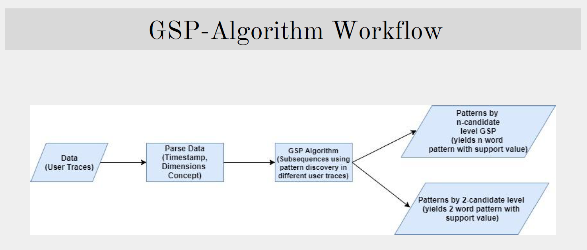

# Discovery of Frequent Sequences in Usage Logs 

The repo. contains Master Course Work Case Study. The work consists of **discovering frequent** (sequential patterns) into the data of user trace. The data is collected from user traces : the actions of several users visiting a virtual and 3D museum. The objects in the meseum
are grouped in categories (Churchs, Castels, Farms, Houses, Paintings, ...), and described with there location, date, usage. The purpose is to find the subsequences of objects visited, such as : a Church is often visited after a Castel using GSP Algorithm. 

#### The work was supervised by Prof. F. Guillet (LS2N / DUKe, Nantes, France). 

